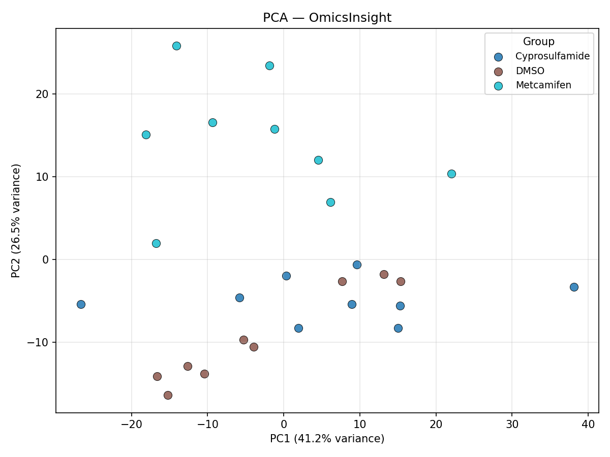
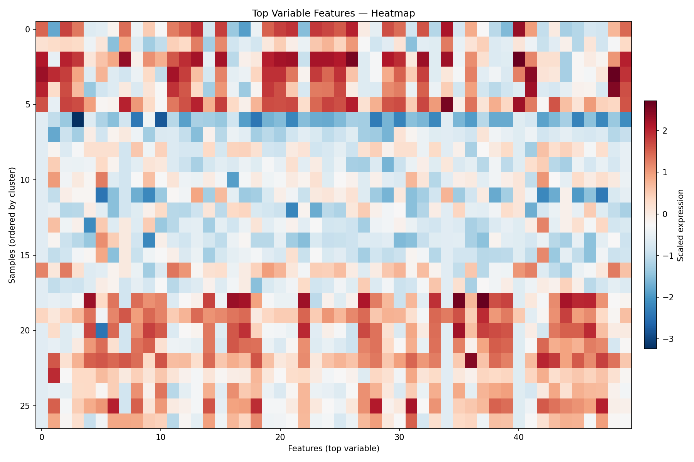

# OmicsInsight

**Transcriptomics-focused analysis pipeline** — exploratory machine learning, dimensionality reduction, clustering, and interpretable feature ranking for preprocessed count-based expression data.

Validated on a public plant transcriptomics dataset ([GSE124666](https://www.ncbi.nlm.nih.gov/geo/query/acc.cgi?acc=GSE124666): safener-treated rice cultures), designed as a reusable analysis tool for similar tabular transcriptomics inputs.

---

## Motivation

This project demonstrates practical bioinformatics workflow development for **high-dimensional transcriptomics data**:

- Parsing and integration of GEO-formatted count data and metadata
- Robust preprocessing (log transformation, variance filtering, feature selection)
- Unsupervised methods (PCA, UMAP, KMeans, hierarchical clustering)
- Exploratory supervised classification (Logistic Regression, Random Forest) with Leave-One-Out cross-validation
- Interpretable feature ranking from multiple methods
- Automated Markdown reporting with biological context and limitations

The goal is a clean, reusable Python tooling for count-based transcriptomics data that is straightforward to run on new datasets with minimal configuration.

---

## Dataset

**GSE124666** — *Transcriptome response to safener treatment in rice cell cultures*

- Organism: *Oryza sativa* (rice), cultivar Tsukinohikari
- Design: 3 treatments (DMSO control, metcamifen, cyprosulfamide) × 3 time points (30, 90, 240 min) × 3 biological replicates = **27 samples**
- Features: ~46,000 gene-level raw counts (Illumina HiSeq 2000, RNA-Seq)

### Dataset placement

The dataset files must be placed in the project directory **before** running the pipeline:

```
OmicsInsight/
└── dataset/
    └── GSE124666/
        ├── GSE124666_NGS_000247_countData.txt
        └── GSE124666_series_matrix.txt
```

> **Note:** This project works entirely offline with local files. No data is downloaded at runtime.

---

## Project Structure

```
OmicsInsight/
├── dataset/                          # Input data (user-provided)
│   └── GSE124666/
├── outputs/                          # Generated at runtime
├── omicsinsight/                     # Core library
│   ├── __init__.py
│   ├── config.py                     # Pipeline configuration (dataclass + YAML)
│   ├── dataset_parser.py             # GEO series matrix + count matrix parsers
│   ├── io.py                         # File I/O helpers
│   ├── validation.py                 # Data integrity checks
│   ├── preprocessing.py              # Log transform, filtering, scaling
│   ├── dimensionality_reduction.py   # PCA + optional UMAP
│   ├── clustering.py                 # KMeans, Agglomerative, evaluation
│   ├── modeling.py                   # LOO-CV classification
│   ├── feature_ranking.py            # Variance, LogReg, RF importance ranking
│   ├── reporting.py                  # JSON summary + Markdown report
│   ├── pipeline.py                   # Orchestrator
│   └── utils.py                      # Logging setup
├── cli/
│   └── run_pipeline.py               # CLI entry point
├── api/
│   └── main.py                       # FastAPI backend
├── configs/
│   └── example_config.yaml           # Example YAML configuration
├── tests/                            # Pytest test suite
├── requirements.txt
├── .gitignore
└── README.md
```

---

## Installation

```bash
# Clone the repository
git clone https://github.com/theibrrr/OmicsInsight.git
cd OmicsInsight

# Create a virtual environment
python -m venv venv
venv\Scripts\activate        # Windows
# source venv/bin/activate   # macOS/Linux

# Install dependencies
pip install -r requirements.txt
```

**Python 3.9+** is required. UMAP is optional — the pipeline will skip it gracefully if `umap-learn` is not installed.

---

## Usage

### CLI

```bash
python cli/run_pipeline.py \
  --counts dataset/GSE124666/GSE124666_NGS_000247_countData.txt \
  --metadata dataset/GSE124666/GSE124666_series_matrix.txt \
  --target treatment \
  --sample-id sample_id \
  --output outputs/run_01 \
  --max-features 500 \
  --n-clusters 3
```

Or use a YAML config:

```bash
python cli/run_pipeline.py --config configs/example_config.yaml
```

Run `python cli/run_pipeline.py --help` for all options.

### FastAPI

```bash
uvicorn api.main:app --reload
```

Open `http://127.0.0.1:8000/` in a browser for the **web UI** — fill in file paths, click **Run Analysis**, and view results (metrics, PCA plot, top features, download links) directly in the page.

Endpoints:

| Method | Path | Description |
|--------|------|-------------|
| `GET`  | `/` | Web UI |
| `GET`  | `/health` | Liveness check |
| `POST` | `/analyze` | Run pipeline (JSON body) |
| `GET`  | `/results/{run_id}` | Retrieve analysis summary |

Interactive API docs: `http://127.0.0.1:8000/docs`

---

## Outputs

After a pipeline run, `outputs/<run_id>/` contains:

| File | Description |
|------|-------------|
| `analysis_summary.json` | Machine-readable full summary |
| `report.md` | Human-readable Markdown report |
| `pca_scatter.png` | PCA scatter plot coloured by treatment |
| `umap_scatter.png` | UMAP scatter (if enabled) |
| `cluster_heatmap.png` | Heatmap of top variable features |
| `cluster_labels.csv` | Per-sample cluster assignments |
| `ranked_features.csv` | Full feature ranking table |
| `top_features.json` | Top 20 features with scores |
| `metadata.csv` | Parsed sample metadata |
| `model_*.joblib` | Persisted classifiers |
| `scaler.joblib` | Fitted StandardScaler |
| `pca_components.csv` | PCA scores per sample |

---

## Pipeline Steps

1. **Parse** — Read count matrix and GEO series matrix; extract per-sample metadata (treatment, time point, replicate)
2. **Align** — Match samples between files using NGS247 identifiers
3. **Validate** — Check for duplicates, missing data, non-numeric values, mismatched IDs
4. **Preprocess** — Log2(x+1) transform → low-count gene filter → low-variance filter → top-N feature selection → StandardScaler
5. **PCA** — Principal component analysis with scatter plot
6. **UMAP** — Optional nonlinear embedding
7. **Clustering** — KMeans + Agglomerative (Ward) with silhouette score and Adjusted Rand Index
8. **Classification** — Leave-One-Out CV with Logistic Regression and Random Forest; accuracy, macro F1, confusion matrix
9. **Feature ranking** — Variance, LogReg coefficients, RF importance → combined average rank
10. **Reporting** — JSON summary + Markdown report with biological interpretation and limitations

---

## Validation Results — GSE124666

Full pipeline run on 27 rice samples (3 treatments × 3 time points × 3 replicates).

**Preprocessing**

| Step | Genes / Features |
|---|---|
| Raw count matrix | 46,102 |
| After low-count filter (≥10 total) | 35,931 |
| Top by variance (selected) | **500** |

**PCA**



PC1 (41.2%) and PC2 (26.5%) together explain 67.7% of variance. Metcamifen samples (teal) separate cleanly along PC2, forming a distinct cluster in the upper half of the plot. DMSO (brown) and cyprosulfamide (blue) overlap along PC1, consistent with their shared solvent baseline and closer transcriptional profiles at early time points.

**Clustering**



| Method | Silhouette | ARI vs. treatment |
|---|---|---|
| KMeans (k=3) | 0.27 | 0.26 |
| Agglomerative Ward (k=3) | 0.25 | 0.19 |

The heatmap shows three blocks of samples ordered by KMeans cluster assignment. The top block (rows 0–5) shows consistently high expression (red) across top variable features — these correspond to the metcamifen cluster. The middle block is predominantly low expression (blue), and the bottom block shows mixed but elevated expression at a subset of features. Moderate ARI scores reflect the partial overlap between DMSO and cyprosulfamide groups.

**Classification (LOO-CV, n=27)**

| Model | Accuracy | Macro F1 |
|---|---|---|
| Logistic Regression | **77.8%** | 0.78 |
| Random Forest | 70.4% | 0.70 |

Metcamifen was classified with **100% accuracy** by both models (9/9). All misclassifications were between DMSO and cyprosulfamide — biologically consistent with their chemical similarity and the PCA overlap observed above.

**Top candidate gene:** `LOC_Os07g13770` — highest combined rank across variance, logistic regression coefficients, and Random Forest importance. Full ranking in `outputs/run_ui/ranked_features.csv`.

> All ML results are exploratory (n=27). See [Limitations](#limitations).

---

## Using with Other Datasets

The pipeline is not limited to GSE124666. Any preprocessed count matrix paired with a metadata file can be analysed.

**Minimum requirements**

| Input | Requirement |
|---|---|
| Count matrix | Tab-separated, genes × samples; first column = gene IDs; remaining columns = sample IDs |
| Metadata | GEO series matrix **or** plain CSV/TSV with a header row |

**Parameters to set per dataset**

| Parameter | Required? | Notes |
|---|---|---|
| `counts_path` | ✅ Always | Path to count matrix file |
| `metadata_path` | ✅ Always | Path to metadata file |
| `target_column` | ✅ When classifying | Must match a column name in the metadata (e.g. `treatment`, `condition`) |
| `sample_id_column` | ⚠️ If non-default | Default: `sample_id`; use `--sample-id` at CLI if named differently |

**Metadata auto-detection** — `parse_metadata()` inspects the first line:
- Starts with `!` → **GEO series matrix** parser (`!Sample_*` rows, multi-characteristic support)
- Otherwise → **CSV / TSV** parser (first column promoted to `sample_id` if no `sample_id` column exists)

---

## Testing

```bash
pytest tests/ -v
```

Tests cover: parser logic, validation rules, preprocessing steps, config loading, and a full pipeline integration test on synthetic data.

---

## Limitations

1. **Small sample size (n=27):** All ML results are exploratory. LOO-CV metrics may have high variance.
2. **No formal normalization:** Log2(x+1) is used instead of TMM/DESeq2 size factors.
3. **Feature selection before CV:** Top features selected by variance on all data (unsupervised, but not embedded in CV folds).
4. **No pathway enrichment:** Gene IDs are reported without functional annotation.
5. **Multi-mapping counts:** The original data allowed up to 6 gene alignments per read.
6. **Single dataset validation:** The pipeline is validated on GSE124666 only, though designed to be reusable.

---

## Future Improvements

- Embed feature selection within CV loop for unbiased estimates
- Add DESeq2-style normalization (via rpy2 or pydeseq2)
- Gene annotation mapping (MSU → GO/KEGG)
- Interactive Plotly dashboards
- Batch correction for multi-experiment analysis
- Docker containerisation
- Support for AnnData / HDF5 formats

---

## License

MIT

---
